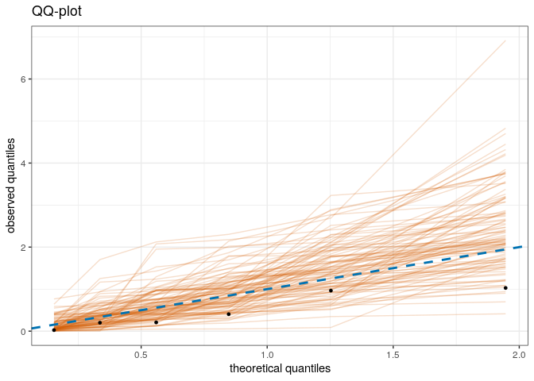

<!-- README.md is generated from README.Rmd. Please edit that file -->
extreme random forest
=====================

<!-- badges: start -->
[](https://github.com/nicolagnecco/erf/actions) <!-- badges: end -->

The goal of erf is to predict extreme quantiles within the quantile forest framework of Athey, Tibshirani, and Wager (2019 <https://doi.org/10.1214/18-AOS1709>).

Installation
------------

<!-- You can install the released version of erf from [CRAN](https://CRAN.R-project.org) with: -->
``` r
install.packages("erf")
```

You can install the development version from [GitHub](https://github.com/) with:

``` r
# install.packages("devtools")
devtools::install_github("nicolagnecco/erf")
```

Example
-------

This is a basic example which shows you how to peform prediction with `erf`. Let us create some datasets and fit a `quantile_forest` from the `grf` package.

``` r
library(erf)
library(grf)
set.seed(42)

n <- 500
p <- 10
X <- matrix(rnorm(n * p), n, p)
Y <- X[, 1] * rnorm(n)
object <- quantile_forest(X, Y, quantiles = c(0.1, 0.5, 0.9))
```

Now we can create a test dataset and predict extreme quantiles with `predict_erf`.

``` r
n_test <- 20
X.test <-  matrix(rnorm(n_test * p), n_test, p)
Y.test <- X.test[, 1] * rnorm(n_test)

quantiles <- c(.99, .999)
threshold <- 0.8

res <- predict_erf(object, quantiles = quantiles, threshold = threshold,
                   newdata = X.test, model_assessment = TRUE,
                   Y.test = Y.test, out_of_bag = FALSE)

head(res$predictions)
#>      quantile =  0.99 quantile =  0.999
#> [1,]         1.325343          2.375495
#> [2,]         1.325832          2.494542
#> [3,]         1.653963          2.544473
#> [4,]         1.169691          1.902427
#> [5,]         1.188074          2.226763
#> [6,]         2.631909          3.659733
res$plot
```



References
----------

Athey, Susan, Julie Tibshirani, and Stefan Wager. 2019. “Generalized Random Forests.” *The Annals of Statistics* 47 (2): 1148–78. [	https://doi.org/10.1214/18-AOS1709](	https://doi.org/10.1214/18-AOS1709).
